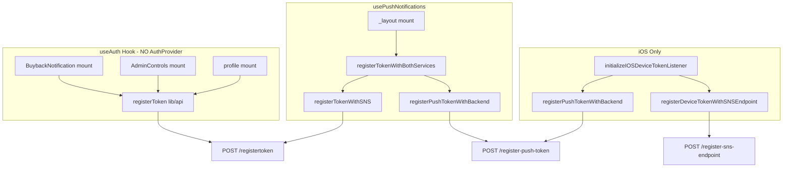

# Outix Live App - Comprehensive Analysis Plan

## 1. Duplicate API Calls

### 1.1 getMyAlerts - Multiple Callers

The same `getMyAlerts` API is called from several places on app load and navigation:

| Location                                                                     | Trigger                                                   | When                                       |
| ---------------------------------------------------------------------------- | --------------------------------------------------------- | ------------------------------------------ |
| [app/(tabs)/index.tsx](app/(tabs)/index.tsx)                                 | `loadNotifications()` in `useEffect([])`                  | Home tab mount                             |
| [contexts/NotificationContext.tsx](contexts/NotificationContext.tsx)         | `loadNotifications()` in `useEffect([loadNotifications])` | App init (NotificationProvider wraps app)  |
| [app/(tabs)/alerts.tsx](app/(tabs)/alerts.tsx)                               | `useEffect` on mount                                      | Alerts tab mount                           |
| [components/notification-dropdown.tsx](components/notification-dropdown.tsx) | `useEffect` when `visible`                                | When user opens dropdown                   |
| [app/_layout.tsx](app/_layout.tsx)                                           | `handleNotificationData` fallback                         | When matching notification by type/message |

**Impact:** On app launch with home tab, both index and NotificationContext call `getMyAlerts` - **2 duplicate calls**. When user opens Alerts tab, a 3rd call. When user opens notification dropdown, a 4th call.

### 1.2 getPromoters

- [app/(tabs)/index.tsx](app/(tabs)/index.tsx): `loadPromoters()` in `useEffect([])` - single caller, but runs on every index mount (e.g., tab switch back).

### 1.3 loadEvents

- [app/(tabs)/events.tsx](app/(tabs)/events.tsx): `loadEvents()` in `useEffect([])` - runs on tab mount.

---

## 2. Token Registration - Critical Issues

### 2.1 Multiple Registration Paths (Duplicate Calls)

Token registration is triggered from **5+ different code paths**:

**Root cause:** `useAuth` has **no AuthProvider** - each component calling `useAuth()` gets its own state and runs `loadUser` + `registerToken` independently. Components using `useAuth`:

- [components/buyback-notification.tsx](components/buyback-notification.tsx) - always mounted (in root layout)
- [components/admin-controls.tsx](components/admin-controls.tsx) - mounted when Header is shown (index)
- [app/(tabs)/profile.tsx](app/(tabs)/profile.tsx) - when profile tab mounts
- [components/buyback-alert-item.tsx](components/buyback-alert-item.tsx) - when rendered

**Result:** 2-4+ `registerToken` (lib/api) calls on app load. Plus `registerTokenWithBothServices` from usePushNotifications. Plus iOS listener callbacks.

### 2.2 Different Tokens Sent to Backend

Three token sources exist, potentially returning different values:

| Source                    | Location                                             | Used By                                            | Format                                                                        |
| ------------------------- | ---------------------------------------------------- | -------------------------------------------------- | ----------------------------------------------------------------------------- |
| `getDeviceToken()`        | [lib/deviceToken.ts](lib/deviceToken.ts)             | useAuth, lib/api                                   | AsyncStorage (APNsDeviceToken/FCMDeviceToken) - may be stale or from Expo/FCM |
| `getDevicePushToken()`    | [lib/pushNotifications.ts](lib/pushNotifications.ts) | usePushNotifications, registerPushTokenWithBackend | expo-notifications `getDevicePushTokenAsync()`                                |
| `getExpoPushTokenAsync()` | [lib/pushNotifications.ts](lib/pushNotifications.ts) | registerPushTokenWithBackend                       | ExponentPushToken[...] (Expo format)                                          |

**registerPushTokenWithBackend** sends a payload with `deviceToken`, `pushToken`, and `expoPushToken` - three different token types to `/register-push-token`. The backend's primary endpoint is `/registertoken` (expects native APNs/FCM token). Sending Expo token or inconsistent tokens can cause backend to store wrong/multiple tokens per device.

### 2.3 Different Endpoints Used

- `lib/api.ts registerToken` → `POST /registertoken/{token}` (devicetoken header)
- `awsSnsServiceSimple.ts registerTokenWithSNS` → `POST /registertoken/{token}` (same endpoint, duplicate)
- `registerPushTokenWithBackend` → `POST /register-push-token` (different payload, may 404 - "route not implemented")
- `registerDeviceTokenWithSNSEndpoint` → `POST /register-sns-endpoint` (SNS-specific)

---

## 3. Deprecated and Outdated Libraries

### 3.1 Deprecated (Remove or Replace)

| Package     | Version   | Status                                                                                                                                 |
| ----------- | --------- | -------------------------------------------------------------------------------------------------------------------------------------- |
| **aws-sdk** | ^2.1693.0 | **End-of-support Sept 2025** - Not imported in app code; SNS is via backend `fetch`. Safe to remove from [package.json](package.json). |

### 3.2 Potentially Unused / Conflicting

| Package                     | Version | Issue                                                                                                              |
| --------------------------- | ------- | ------------------------------------------------------------------------------------------------------------------ |
| **react-native-navigation** | ^8.7.4  | Different navigation stack than expo-router. Project uses expo-router. Likely dead dependency - verify no imports. |

### 3.3 Behind Current Versions

| Package              | Current | Project |
| -------------------- | ------- | ------- |
| Expo SDK             | 55      | 54      |
| React Native         | 0.83+   | 0.81.5  |
| @sentry/react-native | 8.x     | 7.2     |

---

## 4. Crash and Stability Risks

### 4.1 No AuthProvider - State Fragmentation

Each `useAuth()` call creates independent state. Login in one component does not update others until remount. Logout may leave stale state in unmounted components.

### 4.2 JSON.parse Without Try-Catch

- [hooks/useAuth.ts](hooks/useAuth.ts) line 56: `JSON.parse(savedUser)` - if corrupted data, will throw and crash.
- Similar patterns in API response parsing - some have try/catch, some may not.

### 4.3 Duplicate Route Structure

- `app/(tabs)/event/[id].tsx` and `app/event/[id].tsx` - duplicate event detail screens
- `app/(tabs)/promoter/[id].tsx` and `app/promoter/[id].tsx` - duplicate promoter screens

This can cause routing ambiguity and maintenance burden. Expo Router may resolve to different routes.

### 4.4 devicePushToken Null Access

- [app/_layout.tsx](app/_layout.tsx) lines 411-416: `devicePushToken.data.substring(...)` - if `devicePushToken` is null, will crash. Code checks `if (devicePushToken)` but in a different `useEffect` - ensure all access is guarded.

### 4.5 getDeviceToken Throws

- [lib/deviceToken.ts](lib/deviceToken.ts): `getDeviceToken()` throws if token unavailable. Callers in useAuth catch, but `lib/api.ts getPromoters` and others use it - ensure all callers handle errors.

---

## 5. Recommended Fixes (Summary)

### High Priority

1. **Create AuthProvider** - Wrap app with AuthContext so `useAuth` is a single source of truth. Move `registerToken` to one place (e.g., after auth state is loaded).
2. **Deduplicate token registration** - Single registration flow: use `getDeviceToken` from deviceToken.ts, call `lib/api registerToken` once after token is available. Remove token registration from useAuth's loadUser; keep only in usePushNotifications or a dedicated TokenRegistration component.
3. **Consolidate getMyAlerts** - Use NotificationContext as single source. Remove `loadNotifications` from index.tsx; have index consume `useNotifications().refreshNotifications` or similar. Alerts tab can call refresh when focused.
4. **Guard devicePushToken** - Add null checks before `devicePushToken.data` access in _layout.tsx.

### Medium Priority

1. **Remove aws-sdk** - Unused; remove from package.json.
2. **Audit react-native-navigation** - Remove if unused.
3. **Unify token source** - Use `getDeviceToken` from deviceToken.ts everywhere for backend registration. Ensure iOS native token is stored before any registration (coordinate with initializeIOSDeviceTokenListener).
4. **Resolve duplicate routes** - Keep `(tabs)/event/[id]` and `(tabs)/promoter/[id]`; remove or redirect `app/event/[id]` and `app/promoter/[id]` if redundant.

### Lower Priority

1. **Upgrade Expo/Sentry** - Plan upgrade to SDK 55 and Sentry 8.
2. **Add Sentry breadcrumbs** - For token registration and API calls to debug production issues.

## 6. Recommended Implementation Order

1. Land `AuthProvider` (single source of truth) so other side effects become deterministic.
2. Deduplicate token registration into one component/hook and register exactly once per auth session/device.
3. Consolidate `getMyAlerts` to NotificationContext and ensure list refresh happens only on intended events (mount/focus/manual).
4. Fix the crash risk items (`devicePushToken` guards, unsafe `JSON.parse`).
5. Remove/redirect duplicate routes and then do dependency cleanup.
6. Add breadcrumbs/logging and verify using network traces.

## 7. Verification Checklist

1. On cold app launch with Home tab: `getMyAlerts` should fire exactly once (no extra callers).
2. When switching tabs (Home <-> Alerts): no background/duplicate `getMyAlerts` calls beyond the expected refresh.
3. Token registration: exactly one backend registration call per expected token source (and no inconsistent token payloads).
4. iOS device token listener: no crashes and no duplicate registrations caused by listener + hook overlap.
5. Navigate to event/promoter detail: correct screen loads regardless of whether `(tabs)/...` or `app/...` path is used.
6. No runtime crashes in `_layout.tsx` when push tokens are null/unavailable.

## 8. Task Breakdown (Subtasks + Acceptance)

### 8.1 `authprovider-single-source`

1. Add/implement a single app-level `AuthProvider` that stores auth state and exposes `useAuth()` from context.
2. Move side effects currently triggered in `useAuth()` (especially `loadUser` and token registration) into the provider so they run once.
3. Update all components/hooks to rely on the provider-backed `useAuth()` (avoid creating independent state per component).

Acceptance: login/logout updates all consumers without remount; token registration is deterministic (no multiple registrations caused by multiple `useAuth` instances).

### 8.2 `dedupe-token-registration`

1. Decide the authoritative token payload for backend registration (avoid mixing `getDeviceToken` with expo/push token formats in the same run).
2. Implement a single `TokenRegistration` flow that owns backend registration and runs exactly once when prerequisites are met (auth loaded + token available).
3. Add idempotency (guard keyed by device installation/auth session) to prevent duplicate calls on remount/focus.
4. Remove/disable duplicate registration calls from other mount paths (formerly driven by `useAuth` and/or `_layout`).

Acceptance: network traces show exactly one backend registration call per intended token type; no duplicate calls when switching tabs.

### 8.3 `dedupe-getMyAlerts`

1. Make `NotificationContext` the single source of truth for alert/notification list state.
2. Remove `loadNotifications()` triggers from `app/(tabs)/index.tsx` and any other redundant callers.
3. Add an explicit refresh mechanism (e.g. `refreshNotifications`) called only on intended lifecycle events (initial app load, alerts tab focus, or user action).
4. Ensure dropdown rendering reads existing context state and does not refetch.

Acceptance: cold launch calls `getMyAlerts` exactly once; opening dropdown does not increase the call count.

### 8.4 `guard-devicePushToken`

1. Search for all `devicePushToken.data` accesses in `app/_layout.tsx`.
2. Ensure token formatting/substring logic is guarded inside the same effect scope where the token is available (no stale closures).
3. If token is null, skip derived formatting and keep UI state safe defaults.

Acceptance: no crashes when push tokens are null/unavailable.

### 8.5 `resolve-duplicate-routes`

1. Identify duplicate routes: `app/(tabs)/event/[id].tsx` vs `app/event/[id].tsx`, and promoters similarly.
2. Choose canonical routes (prefer `(tabs)/...` variants unless there is a proven reason otherwise).
3. Implement `redirect`/removal/adjustment so expo-router resolution is deterministic.
4. Update any navigation `Link`/router calls to target the canonical route paths.

Acceptance: navigating to event/promoter detail always loads the correct screen.

### 8.6 `cleanup-deps`

1. Confirm runtime usage by scanning imports/usages of `aws-sdk` and `react-native-navigation`.
2. Remove dead dependencies from `package.json`.
3. Update lockfile and verify build still succeeds.

Acceptance: CI/build passes and no missing module errors occur.

### 8.7 `harden-json-parse`

1. Locate unsafe `JSON.parse` usage for stored user/state (e.g. in `hooks/useAuth.ts`).
2. Wrap parsing in try/catch and handle failure by clearing corrupted storage and reverting to a safe default (logged out).
3. Optionally add minimal validation of the parsed shape.

Acceptance: corrupted storage does not crash the app; user is cleanly reset.

### 8.8 `add-observability`

1. Add breadcrumbs/logging around token registration steps and notification fetch calls.
2. Include a correlation id for a “registration run” and log the token source(s) used.
3. Verify in logs that duplicates are eliminated and call counts match the intended lifecycle.

Acceptance: dev/prod logs clearly show one registration run and one alert fetch per intended lifecycle.